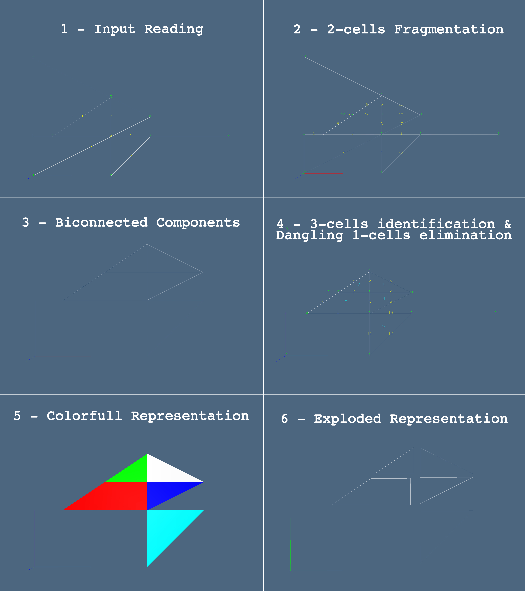

# Arrangement of cellular complexes in two-dimensional spaces

The module Arangement provides two dimensional space arrangements via the following method (accesible from the `LinearAlgebraicRepresentation` namespace):

```@docs
Lar.planar_arrangement
```

In general we recall the notation we have used in source code:
 - `V::Lar.Poins` is the 1-cells (Vertices) complex.
 - `EV::Lar.Cells` is the 2-cells (Edges) complex.
 - `FV::Lar.` is the 3-cells (Faces) complex.
 - `copEV::Lar.ChainOp`: is the Chain Coboundary of the 2-cells.
 - `copFE::Lar.`: is the Chain Coboundary of the 3-cells.
 - `bigPI::Array{Array{Int64,1},1}`: is the bounding box intersection array:
 	each row is associated to a 2-cell and contains the indices of the other 2-cells intersecting its bounding box.

!!! warning
    Do remember that in `planar_arrangement` (`Lar.Arrangement` module) matrices store points per row and not per column as described in the documentation of `Lar.Points`.

## The algorithm

In this section we will provide a general overview of how the `planar_arrangement` is meant to work.

The algorithm is divided into the following pipeline:
 - Fragmentation of the 2-Cells
   - Spatial Indexing
   - Pairwise 2-Cells Fragmentation
   - Vertices Identification
 - Biconnected Components Detection.
 - 3-Cells Evaluation and Dangling 2-Cells Elimination.

### Fragmentation of the 2-Cells

This part of the pipeline is covered by:
```@docs
Lar.Arrangement.planar_arrangement_1
```
A small set of optional parameters could be choosen in order to personalize the computation:
 - `sigma::Lar.Chain`: if specified, the arrangement will delete from the output every edge outside this cell
                        (*by defaults* = empty cell, no boundary).
 - `return_edge_map::Bool`: If set to true, the function will also return an `edge_map` that maps the input edges to
                        the corresponding output ones.
 - `multiproc::Bool`: If set to true, execute the arrangement in parallel (*by default* = false, sequential).


Once the data have been aquired, a spatial indexing between the 2-cells is made up in order to speed up the computation.
```@docs
Lar.spaceindex
```


Then each single 2-cell is fragmented by intersecting it with the other 2-cells that shares the same bounding box.
This process is either done in a parralel or a sequtial way via:
```@docs
Lar.Arrangement.frag_edge_channel
Lar.Arrangement.frag_edge
```
if the parallel way is choosen (namely `frag_edge_channel` is used) then a few more parameters must be specified:
 - `in_chan::Distributed.RemoteChannel{Channel{Int64}}`: an input channel made of the edges indices to be intersected;
        the channel must also hold at the end an EoW (`-1`) indicator for each worker thread in use.
 - `out_chan::Distributed.RemoteChannel{Channel{Int64}}`: a ready-to-use output channel.


In order to split the edge, at a lower level, each pair of possible intersecting 2-cells are compared via:
```@docs
Lar.Arrangement.intersect_edges
```

In the end, the 1-cells are identified if they are located spatially very close one to the other (_i.e_ ``\epsilon = 10^{-4}``).
Of course if two 2-cells share the same endpoints then they are also identified in a unique 2-cell.
```@docs
Lar.Arrangement.merge_vertices!
```
Here also two optional parameters could be specified:
 - `edge_map::Array{Array{Int64,1},1}`: Mapping from a set of edges to the edges of the given cochain.
        If it is given in input than a copy of it would be returned in output, with its values coherently rearranged with the vertices merging (*by default* = ``[[-1]]``).
 - `err::Float64`: Range of the vertex identification (*by default* = ``1e-4``).

!!! note
    Choosing a good value for `err` is a very important issue.
    Note that the identification is sequentially made;
    therefore the following situation could happend:
    if three vertices are collinear and evenly spaciated, then
      - if the second is identified in the third,
      	then the first and the third won't be identified;
      - if the thiird is identified with the second,
      	then the first and the second will be identified;
    
    This situation could be seen in the secon example given by the function documentation.

### Biconnected Components Detection.

### 3-Cells Evaluation and Dangling 2-Cells Elimination.

## Examples

```julia
using Plasm
using LinearAlgebraicRepresentation
Lar = LinearAlgebraicRepresentation;

# Data Reading
V = [
	0.0 0.5 3.0 5.0 2.0 2.0 0.0 1.0 0.0 3.0; 
	1.0 1.0 1.0 1.0 2.0 0.0 3.0 1.5 0.0 1.5
	];
EV = [[1, 4], [2, 3], [5, 6], [2, 5], [3, 6], [7, 10], [8, 10], [9, 10]];

## 1 - Input Reading
Plasm.view(Plasm.numbering(0.5)((V,[[[k] for k=1:size(V,2)], EV])));

# Planar Arrangement 1
W = convert(Lar.Points, V'); # Infering type for W = V'
copEV = Lar.coboundary_0(EV::Lar.Cells);
W1, copEV1 = Lar.planar_arrangement_1(W::Lar.Points, copEV::Lar.ChainOp);

## 2 - 2-cells fragmentation
EV1 = Lar.cop2lar(copEV1);
V1 = convert(Lar.Points, W1');
Plasm.view(Plasm.numbering(0.5)((V1,[[[k] for k=1:size(V1,2)], EV1])));

# Biconnected COmponent Evaluation
bicon_comps = Lar.Arrangement.biconnected_components(copEV1);

## 3 - Biconnected Components
hpcs = [ Plasm.lar2hpc(V1,[EV1[e] for e in comp]) for comp in bicon_comps ]
Plasm.view([ Plasm.color(Plasm.colorkey[(k%12)==0 ? 12 : k%12])(hpcs[k]) for k = 1 : (length(hpcs)) ])

# computation of 2-cells and 2-boundary
W2, copEV2, copFE2 = Lar.planar_arrangement_2(W1, copEV1, bicon_comps)

## 4 - 3-cells identification & dangling 1-cells elimination
Plasm.view( Plasm.numbering1(0.5)((W2, copEV2, copFE2)) )


# 5 - Colorfull Representation
triangulated_faces = Lar.triangulate2D(W2, [copEV2, copFE2])
V2 = convert(Lar.Points, W2')
FVs2 = convert(Array{Lar.Cells}, triangulated_faces)
Plasm.viewcolor(V2::Lar.Points, FVs2::Array{Lar.Cells})

# polygonal face boundaries
EVs2 = Lar.FV2EVs(copEV2, copFE2) 
EVs2 = convert(Array{Array{Array{Int64,1},1},1}, EVs2)
Plasm.viewcolor(V2::Lar.Points, EVs2::Array{Lar.Cells})

# 6 - Exploded Representation
model = V2,EVs2
Plasm.view(Plasm.lar_exploded(model)(1.2,1.2,1.2))
```


> **Figure 1:** Pipeline visualization over a sample structure.


